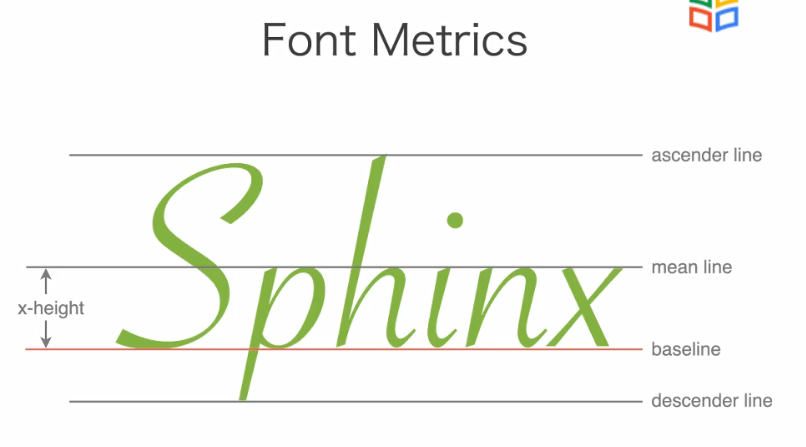
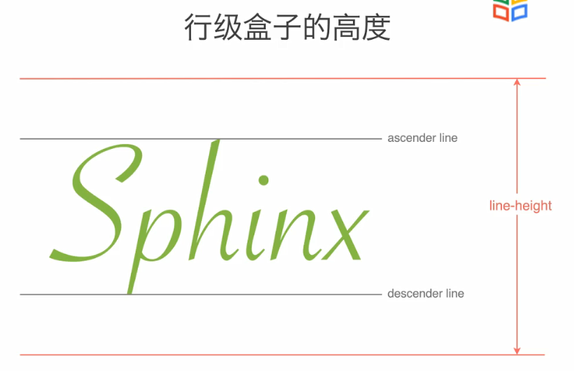
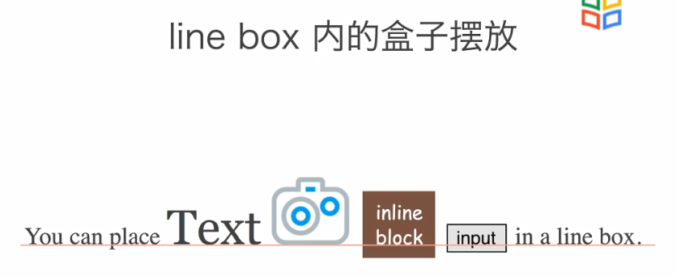
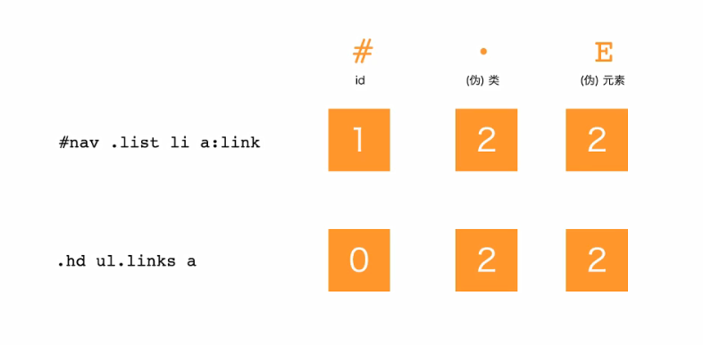
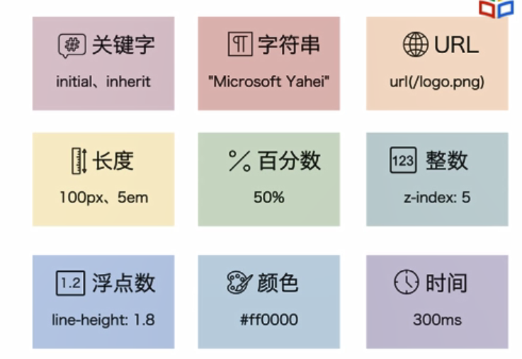
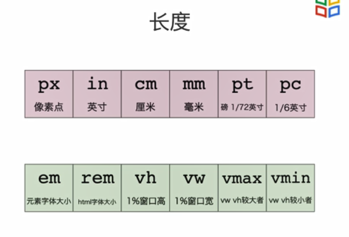

# 第二章 CSS基础

## 2-4 设置文字样式

### text-align属性

这些样式都不会将一个单词在一行的末尾拆开显示。简言之，同一个单词所有的字母都只会出现在一行

- left：文字左对齐
- center：居中对齐
- right：右对齐
- justify：自动调整空格的宽度使得一行的首和尾都有字符

### spacing

- letter-spacing属性，可以以px为单位，表示字母与字母之间的距离，默认为0px
- word-spacing属性，可以以px为单位，表示空格的大小，默认为0px

### text-indent属性

表示首行缩进的大小。默认为0px，可以自行。

### text-decoration属性

- none：正常显示
- underline：有一条下划线
- line-through：有一条贯穿的删除线
- overline：有一条上划线

### white-space 属性

- normal：正常显示，忽略换行，空格合并，按照浏览器宽度显示
- nowrap：正常显示+不换行；就是无论一段多长都不换行，空格合并
- pre：按照编辑时候的样式显示，保留多个空格和换行
- pre-wrap：在前一个的基础上遇到浏览器的最右边的时候自动换行
- pre-line：空格合并，但是换行的格式和编辑的时候一样

### text-shadow属性

- color：阴影的颜色
- offset-x：x的偏移量
- offset-y:  y的偏移量
- blur-radius: 阴影模糊的程度

## 2-5 盒模型

首先css为每个需要添加样式的对象生成一个盒子，包括：

- content，用来显示实际的内容，如文字、图片，content包括height和width
- padding，content和border之间的部分
- border，边框，边框有宽度等等
- margin，页边距，盒子和盒子之间的距离

### content

#### width height

- 指定 content box 的宽度、高度
- 可以为长度、百分数、**auto**
- auto由浏览器根据其它属性确定
- 百分数是相对容器的content box 宽度和高度
- 容器指定了宽度、高度时，百分数才能生效

### padding

padding 的大小有4个属性：padding-top、padding-right、padding-bottom、padding-left

可以分别设置，默认值为0，默认方向为**上右下左**。

padding 的属性的值可以是像素值或者是百分数，百分数为相对于容器的宽度

也可以一口气设置4个方向感padding的值

- 1个属性，为上下左右都是该宽度
- 2个属性，如 10px，20px，表示上下10px，左右20px
- 3个属性，如 10px，20px，30px，为上10px，右20px，下30px，左边默认和右边相同，为20px
- 4个属性，上右下左

### border

用于指定边框的样式、粗细和颜色

- 样式：1. none，没有边框； 2.solid，实现边框； 3.dashed，虚线边框； 4.dotted，点状线边框
- 边框粗细，可以用长度表示
- 边框的颜色

属性设置

- 可以通过 border 属性将以上三种一起设置，都是按照上右下左的方向设置。

- 通过 border-width设置四边的宽度，border-style设置四个边框的样式，border-color设置四个边框的颜色

- 还可以通过 border-top、border-right、border-bottom、border-left分别设置边框四个方向的长度
- 甚至可以通过 border-left-width，border-top-color设置更加细化的属性

### margin

- 用于指定元素四个方向的外边框，也可以使用margin-left、margin-top等属性分别计算
- 取值可以为长度、百分数、auto
- 百分数为相对于容器的宽度

当设置为auto的时候，如果容器比content的左右宽度大，content就会居中显示

#### margin collapse

当上下两个盒子的内容都设置了margin的时候，实际两个盒子的border之间的margin不是两者相加，而是两者之间较大的值。这就是margin collapse现象。而左右的margin之间一般不存在这种现象

magin宽度的值也可以是负值，当为负值的时候可能会和别的盒子有一部分重合

### 设置盒子的大小

我们设置 width 和 height 默认为 content，我们也可以使用box-sizing属性改变设置的对象，如border-box，这样在设置width，height的时候就是设置整个盒子的长宽了

### overflow

当容器的大小不足以容纳整个其中的内容的时候，overflow属性可以改变其多于部分显示的样式

- visible，默认方式，超出的范围会原样显示
- hidden，溢出文本隐藏
- scroll，加一个滚动条，滑动滚动条可以看到隐藏的内容

### min-width、max-width

可以通过min-width和max-width设置最大和最小的宽度。当我们不能预先知道浏览器的宽度的时候，使用这种方式可以使得宽度更加可控

### max-height、min-height

同样的，可以使用max-height和min-height设置最大和最小的高度

## 2-6 CSS 中的盒模型

### 块级盒子和行级盒子

- 块级盒子不能和其它盒子并列摆放，而行级盒子可以放在一行或者拆开成多行
- 块级盒子适用所有的盒模型属性，盒模型中的width和height属性不适用

### 块级元素和行级元素

- 块级元素：body、article、div、main、section、h1-6、p、ul、li等
- 行级元素：span、em、strong、cite、code等
- 块级元素会以块级盒子显示，行级元素会以行级盒子显示

### display属性

- 可以显式设置元素为行级、块级

- 除了块级和行级，还可以设置为 inline-block 类型，该类型本身是行级，可以放在行盒子里面，但是不会拆分为多行，只能在一行显示。所以也可以设置宽和高。

- 设置为none的时候，排版的时候会被忽略，所以不会显示盒子的任何内容

## 2-7 盒子的效果

### border-radius

- 显示盒子的圆角，值为圆角的半径，顺序是从左上开始顺时针
- 也可以显示椭圆的圆角，如 20px/50px ，表示水平方向上半径为 20px，竖直方向上为 50px
- 也可以用百分数，如 30%就表示水平方向上占水平长度的 30%，竖直方向上占竖直方向的 30%
- 如果要设置4个不同的椭圆角，使用方法为类似 10px 20px 30px 40px / 20px 20px 20px 20px 这样的方式，前四个表示水平方向上，后面四个表示竖直方向上

### background

background是一个可以设置概括式的属性，可以设置多个更小范围的属性，包括

- background-color，默认为透明
- background-image，一张图片的url
- background-repeat，默认是repeat，也可以设置为no-repeat，repeat-x，repeat-y等
- background-position，是第一个图片左上角的位置，默认为(0, 0)
- background-size，设置背景图的宽度和高度

可以使用多种方式设置background-position，如top就是图片的上边缘和盒子的上边缘重合，居中显示；left就是左边缘和盒子的左边缘重合，竖直方向上居中显示；20px 20px表示左上角在盒子的 20px 20px位置处；而50% 50%表示将图片的50%和容器的50%重合，也就是和center一样的显示；最后一种表示下边缘距离盒子的 bottom 20px，有边缘距离盒子的右边缘 20px显示

#### background-size

- 100px auto 表示展示的图片宽为100px，高根据图片的长宽比适应
- auto 100% 表示高度为图片的高度，宽度根据图片的长宽比适应
- contain 表示保持长宽比下能完整放进容器的最大尺寸
- cover 表示必须覆盖完全盒子，保持图片的长宽比，这样一部分图片可能会在盒子外面

#### background-clip

表示背景图片填充的方式

- border-box， 默认方式，表示填充整个盒子，包括 border部分
- padding-box， padding和content
- content-box，只填充 content-box

#### background

e.g.: 

background：padding-box red url(./cat.png) no-repeat top center / 100px 100px

表示填充范围为 padding-box，背景色为 red，背景图片为cat.png，采取不重复的方式填充， 图片位于顶部中心位置，图片大小为100px 100px

### box-shadow

- 有5个值作为属性
- 1,2表示阴影向右和向下偏移量，可以为负值，为负就表示向左和向上
- 3 表示阴影的模糊程度
- 4 表示阴影的扩张大小
- 5 表示阴影的颜色

阴影在排版的时候不会占用实际的空间。

## 2-8 行级元素的排版

行级盒子的高度只和line-height有关，而且文字在里面会居中显示。也就是 ascender line 到顶部的距离和 descender line 到底部的距离相等。我们设置padding和border 都不会影响盒子的高度计算，行级盒子的高度只和line-height有关。

line box 里面的各种盒子的对齐方式由vertical-align 属性决定，默认对齐方式是 baseline。

- 文字的baseline默认是小写字母的底端一条线
- 图片的baseline是图片的bottom
- 一个块级盒子的baseline是最下面一行文字的baseline

### vertical-align

- baseline：表示盒子的 baseline 和所在行级盒子的baseline重合
- middle：盒子的baseline和行级盒子的中线重合，所谓中线就是 ascender line 和 descender line 的中间
- top：顶端和行级盒子顶端重合
- bottom：底端和行级盒子底端重合
- text-top：顶端和ascender line 重合
- text-bottom：底端和descender line 重合
- 1px: baseline 上面 1px，如果是负值就是向下移动

## 2-9 CSS 继承

当css的选择器之间有冲突的时候，浏览器如何进行选择？

这是由选择器的特异度来决定的

特异度的选择是 id>（伪）类>(伪)元素

最终计算的结果可以以如上方式式规约为一个数值来比较

- 第一个例子，nav是id，list、link为类，li、a为元素，所以特异度为 122
- 第二个例子，hd、links为类，ul、a为元素，特异度为22

如果产生冲突，会按照特异度大的选择器显示内容

### 继承

- 当一个选择器在被另一个选择器包含的时候，有些css样式默认会继承外界的样式。
- 例如，在p标签上设置字体大小为20px，然后在em标签里面设置颜色为蓝色，则位于p标签里面em标签中的内容是20px大小的蓝色字体。

- 一般来说，字体相关的样式是默认继承的；而关于盒模型相关的样式是不继承的
- 可以显示地用 inherit 值赋予某个属性，使得它为可继承的。

### 初始值

- css 中每个属性都有一个初始值
  - 如background-color的初始值为 transparent
  - margin-left 初始值为 0
- 可以使用initial关键字将属性值重置为默认大小
  - background-color: left

## 2-10 CSS 单位

【注】时间主要用在动画里面

【注】一般rem为16px

### 颜色

- rgb：#xxxxxx 或者 rgb(xx, xx, xx)，x为16进制数字
- hsl (hsv): hsl(x, y%, z%), x为0-359，y和z的范围都是0-100
- keybord，如red、black这种单词代表的颜色

### 透明度

- rgba(xx, xx, xx, xx)、#xxxxxxxx、hsla(x, y%, z%, t)
- 最后一个参数为透明度，或者称为不透明度更合适
- 除了第二种方式为 0-255，其它均为 0-1的取值
- 1为完全不透明，背景色的权重为100%，背景图片被覆盖；0 为完全透明，此时只有背景图片，没有背景色；其余时候是背景色的权值

### 时间

如 animation-during：表示动画持续的时间，可以为s或者ms

