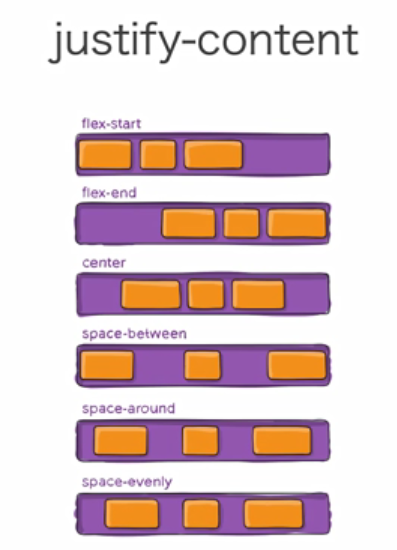
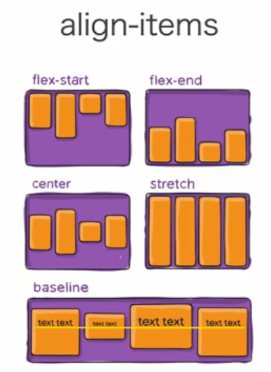
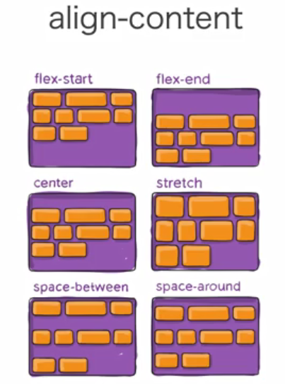
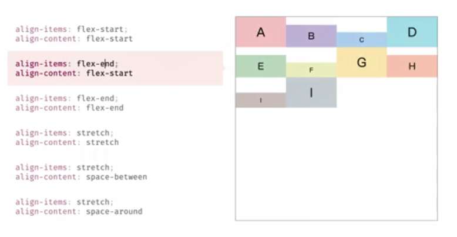
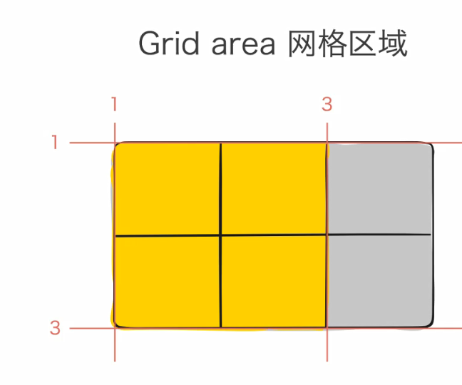
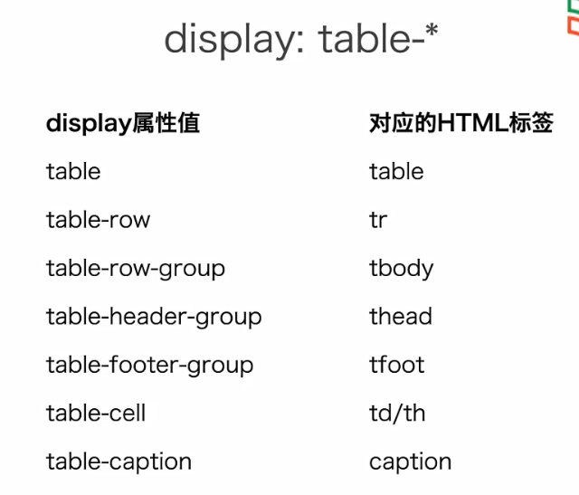
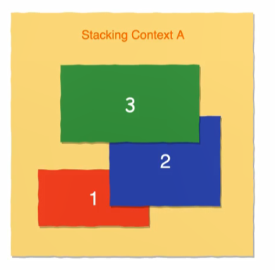
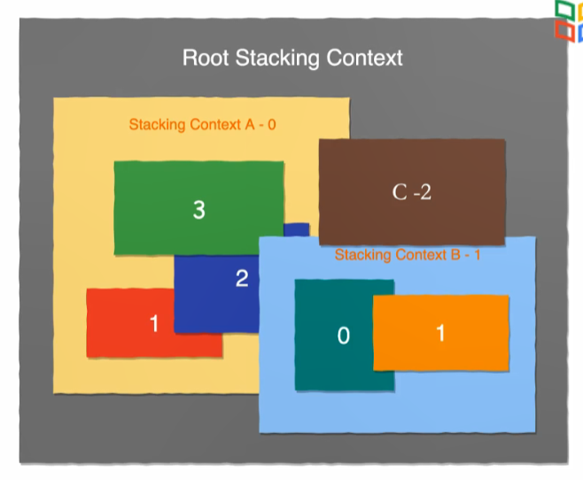

# 第三章 CSS布局

## 3.1 CSS布局概述

### 布局

- 布局会更具内容的大小和位置确定最终的排版
- 计算的时候会一句元素、容器、兄弟结点和内容等信息计算
- 布局分为三种，分别是：常规流、浮动和绝对定位

### 常规流

- 除了根元素、浮动和绝对定位的元素会脱离常规流，其它都在常规流之内
- 包括行级排版上下文、块级排版上下文、表格排版上下文、Flex排版上下文、Grid排版上下文

### 行级排版上下文

- Inline Formatting Context（IFC）
- 只包含行级盒子的容器会创建一个IFC
- IFC内的排版规则
  - 盒子在一行内水平摆放
  - 一行放不下会换行显示
  - text-align决定一行内盒子水平对齐
  - vertical-align决定一个盒子在行内的垂直对齐
  - 会避开浮动元素

### 块级排版上下文

+ Block Formatting Context（BFC）
+ 会创建一个BFC的容器
  + 根元素
  + 浮动、绝对定位、inline-block
  + Flex子项和Grid子项
  + overFlow 值不是 visible 的快盒

### BFC 内的排版规则

- 盒子从上到下摆放、不会放在同一行
- 初值margin合并
- BFC内盒子的margin不会与外面的合并
- BFC不会和浮动元素重叠
- 如果行级盒子里面包含了块级盒子，实际上会将行级盒子外面包一层块级盒子，让后以块级盒子的样式排版
- 所以只能块级盒子里面包含行级盒子而不能行级盒子里面包含块级盒子

## 3-2 Flexible Box（上）

### Flexible Box

- 是一种新的排版上下文
- 可以有许多新特性控制盒子
  - 摆放顺序
  - 摆放流向
  - 盒子宽度和高度
  - 水平和垂直方向的对齐
  - 是否允许折行
  - 盒子的弹性

### 如何设置盒子为 Flexible Box

- 设置 display 属性为 flex，则该元素生成了一个块级 Flex 容器
- 设置 display 属性为 inline-flex，使元素生成一个行级 Flex 容器

### flex-direction属性

- row：从左到右摆放盒子
- row-reverse：从右到左
- column：从上到下
- column-reverse：从下到上

### flex-warp属性

如果flexible box 的direction 是row，则当内容超过盒子的宽度的时候，可以设置 flex-wrap 属性使得内容可以折行显示

- nowrap，默认不折行显示
- wrap，折行显示

### Flexibility

- Flex box 可以设置盒子的弹性，当盒子有剩余空间的时候会伸展，当空间不够的时候会收缩

- flex-grow，设置剩余空间是的伸展能力，默认为0，表示不伸展
- flex-shrink，设置盒子对剩余空间的收缩能力，默认为1，表示可以最大可能收缩
- flex-basis，设置伸展或者伸缩时的基础长度，如果将flex-grow设置为0，又不需要收缩的时候会以 flex-basis属性的值设置盒子的大小

flex-grow、flex-shrink都是不影响content大小的。即收缩或者伸展的时候，如果a的flex-grow 为1， b 为2，而是将整个盒子的大小减去内容必须占的大小，然后按照1:2将剩余空间分配给a和b。即b的空白部分宽度是a空白部分宽度的两倍

flex-basis 比 width 的优先级要高，所以当两者同时在选择器里面的时候，以flex-basis的内容为最终显示结果

可以使用 flex 属性一下子设置三个的值，分别为 flex-grow、flex-shrink、flex-basis

## 3-3 Flexible Box（下）

### justify-content

是用来决定内部容器的摆放格局的

 

- 我们将flex-direction的方向定义为主轴的方向，与主轴方向垂直的方向是侧轴的方向
- space-around和space-evenly的区别是前者是两边margin和中间margin的宽度比例是1:2，而后者的margin都是相等的

### align-items

这里是调整内部容器侧轴方向长短和样式

### align-self

- 有时会需要个别容器的样式和别的不同，可以使用align-self做到

### align- content

使用了align-content后，align-items只能在有限的空间内变化

### order

- flex 布局的容器中，组件默认是按照声明的顺序顺着flex-direaction方向摆放
- 但是我们可以使用order来指定顺序，默认容器的order是0，越大的越会放在后面展示
- order相同按照body部分声明的顺序展示

## 3-4 Grid布局（上）

- Grid可以实现网格的布局

- 采用Grid布局的方式为 display:gird
- 使用 grid-template属性将容器划分为网格
- 可以设置每一个子项占据那些行、列

### grid area

- 内容所占的区域可以由网格线指定，网格线编号默认从1开始
- 通过指定网格的初始和结束网格线可以确定一个区域的位置和大小
- 可以通过`row from/ column from/ row to/ column to` 来指定一个容器所占的区域

- 可以命名网格区域

## 3-5 grid 布局（下）

### grid-gap

- grid-row-gap表示行与行之间的距离
- grid-column-gap表示列与列之间的距离

### justify-items、align-items、align-content、justify-content

- 和 flex box 效果差不多

## 3-6 表格样式

### table-layout

- 当设置为fixed的时候，浏览器不会根据自己设置的列的宽度显示，而是将盒子的宽度均分给每一列显示

### border-collapse

- 当在表格中指定th、td都有border的时候，盒子和盒子之间会有两个border，如果我们想消除一个，可以使用border-collapse属性，将其设为collapse

### 使用CSS实现表格

但是不推荐使用table-标签布局代替html中表格的标签，

## 3-7 float

之前提到的行级排版上下文、块级排版上下文、Flex排版上下文、Grid排版上下文、Table排版上下文都是常规流 Normal Flow。而CSS中还有Float、Absolute Positioning的方式。

float的方式的用处有我们常见的文字环绕图片的排版方式

### 浮动对布局的影响

- 浮动元素脱离常规流，漂浮在容器的左边或者右边
- 浮动元素贴着容器的边缘或者另外的浮动元素
- 浮动元素不会影响常规流里面的块级盒子
- 浮动元素后面的行盒会变短以避开浮动元素

### 控制浮动

- 块级盒子里面是用clear属性可以消除图片浮动的影响，如clear：left 表示不能和左浮动重叠

absolute会向上找一个不是static的祖先进行定位，可以是absolute或者relative

### 将浮动的影响控制在容器内

- Block Formatting Context
  - BFC的高度会包含内部的浮动元素
  - BFC不会和浮动元素上下重合
- 创建BFC
  - overflow非visible
  - float、inline-block、绝对定位

## 3-8 定位

### position属性

- static 默认值，非定位元素
- relative 相对自身原本位置偏移，不脱离文档流
- absolute 绝对定位，相对非 static 祖先元素定位，body容器是static的，html元素不是static的
- fixed 相对于视口绝对定位

### position：relative

- 在常规流里面布局
- 相对于自己本应该在的位置进行偏移
- 使用top、left、bottom、right设置偏移长度
- 流内的其它元素当作它没有偏移一样布局

### position：absolute

- 脱离常规流
- 相对于最近代的非static祖先定位
- 不会对流内元素布局造成影响
- absolute盒子的top和left是左上角相对于外界容器的位置，所以如果想要将absolute盒子的定位为相对于外界非static盒子位置为中间，则要设置margin-top和margin-left分别为absolute盒子的高和宽的一半
- 如果绝对定位内部有行级盒子，则会默认从文本应该在的地方进行绝对定位

### position:fixed

- 相当于ViewPoint定位
- 不会随面滚动而发生位置变化
- 典型的应用就是导航栏

### 3-9 堆叠层级

### z-index

- 为指定元素指定z轴的上下层级
- 用一个整数表示，数值越大，越靠近用户
- 初始值为auto。可以为负数、0、正数
- 只有定位元素才可以设置z-index的值，即只有relative、absolute、fixed的元素才可以设置 z-index

### 堆叠上下文

- 容器的默认z-index为auto，从0开始增加，后面的会覆盖前面的

- 当外界容器相同时，z-index越大越会被至于上层，z-index表示离人的远近

- 

- 当在外层的z-index比另一个盒子内部元素的z-index大的时候，内部盒子无论z-index多大都会显示在另一个盒子外部

- 

### 堆叠上下文的创建

- Root元素
- z-index值不为auto 的relative/absolute
- position是fixed的元素
- 设置了某些属性的元素
  - opacity不为1
  - transform
  - animation

### 绘制顺序

- 在每一个堆叠上下文中，从下到山
  - 形成上下文元素的border和background
  - z-index为负值的子堆叠上下文
  - 常规流内的块级元素
  - 浮动元素
  - 常规流里面的行级元素
  - z-index为0的子元素或者子堆叠上下文
  - z-index为正数的子堆叠上下文

