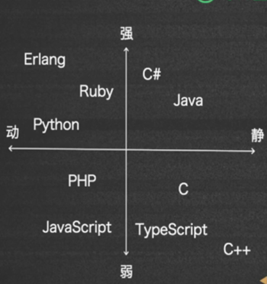
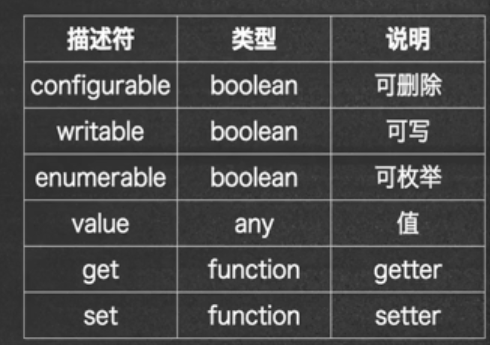

# 第五章 JS基础

## 5-1 js的语言结构

- js支持unicode字符集，和java一样。unicode 字符集可以包括几乎所有的文字符号和颜文字（emoji）
- 通常符号和符号之间可以插入一个或者多个换行符，但一些特殊情况不允许
  - return和返回值之间
  - break/continue 和 label之间
  - 变量和 `++` 或者 `--` 一元运算符之间
  - throw 和 异常对象之间
  - 箭头函数参数列表和箭头`=>`之间
  - yield 和迭代值之间
  - async 和 一步函数声明、函数表达式、方法名之间

### 变量申明

- const：不支持动态绑定，支持块级作用域, ES6+
- let：支持动态绑定和快局作用域，ES6+
- var：ES5的标准，定义会前置，和不支持块级作用域的特点

所以 const 和 let 不能在声明之前访问，而 var 可以，靠的就是前置，即 var 类型变量的声明会统一移到文件最开头，所以可以在定义之前访问。只是在定义之前访问是值为 undifined，而 const 和 let 在定义之前访问会报错。

所谓块级作用域就是块内定义的变量的生命周期只在块里面，就和 c++、java 中 在for循环的参数中定义的int变量在循环外就不能访问一样。

## 5-2 js的语言系统

所谓静态是指不是采用动态类型绑定，所谓弱类型就是指存在隐式类型转换

### 数据类型

- 原始数据类型
  - Null
  - Undefined
  - Number
  - Boolean
  - String
  - Symbol
  - Bigint
- 对象类型
  - 函数
  - 类
  - 生成器

### typeof

 实际上 `typeof null`返回的是`object`，这算是一个历史遗留问题，其它的数据类型都能正确输出。typeof 后面跟着函数名会返回 `function`.

### == 与 ===

- == 存在隐含类型转换
- === 不存在
- 一般除了与null比较外，我们不使用==而使用===。因为有时我们不区分null和undefined

### 隐式类型转换

- null 和 undefined可以相互转化
- number 和 string可以相互转化
- true 和 1，false 和0 可以相互转化
- true/ false + string，相当于‘true’/‘false' + string

## 5-3 JS原始类型

### Null 和 Undefined

- Null 类型和 Undefined 类型都只有一个值，分别为 null 和 undefined
- `null == undefined ` 的值为 true
- undefined 表示未定义，当js引擎找不到这个变量的定义的时候，就会返回 undefined
- null 表示定义了但是没有初始化，或者没有给一个确定的值。
- 有时我们不需要对这两种类型做严格的区分，所以可以用 `== null`来判断一个变量是否为 null 或者undefined

### Number

- js中的number符合 IEEE 754 标准
- 整数有 二进制、八进制、十进制、十六进制
- 可以使用科学计数法表示
- 整数的精确表示从 -2^53+1 到 2^53-1
- 有一个常量可以表示最大的整数：Number.MAX_SAFE_INTEGER，即最大的安全整数
- 二进制以 `0b`开头
- 八进制以`0o`开头
- 十六进制以`0x`开头

### 浮点数

- 浮点数也可以使用科学计数法
- 最大浮点数为 Number.MAX_VALUE, ~= 1.8e308
- 最小浮点数为 Number.MIN_VALUE, ~= 5e-324，这里的最小是指绝对值最小
- 浮点数精度 Number.EPSILON, ~= 2.2e-16, 差值小于这个值的比较都是不精确的
- 无穷大数 Infinity, 也有 -Infinity。如果值超过 Number.MAX_VALUE，就是无穷大数
- 浮点数比较的时候不要直接比较相等，而是比较两者之间的差小于 Number.EPSILON, 否则会出错

### NaN

- NaN 表示 Not  a number，当遇到计算的结果无法表示为数值或者 Infinity、-Infinity 的情况下，计算结果就会是`NaN`
- 如果两个数是 NaN，则两者的任何比较都是false
- 判断一个数是否是NaN可以使用 Number.isNaN() 判断
- 也可以使用 Object.is(n1, n2)比较，当两者都是 NaN时会返回true

### +0 和 -0

- 数值有 +0 和 -0 之分，但是两者之间作比较，返回值是相等的
- 但是用有限数 `/+0` 和 `/-0` 会返回 Infinity 和 -Infinity，可以将它们的差别只是当作一种符号的区别
- 如果一个有限数 / Infinity, /-Infinity 会返回 0 和 -0。
- 0 和 0 相除会返回 NaN，无论数 0 还是 -0（0/0, 0/-0, -0/0, -0/-0）

### Boolean

- 比较操作的结果，只有两个值 true、false
- 存在隐式类型转换，+0， -0， NaN，空串、undefined、null会转换为false，1会转换为 true

### String

- js 中可以使用`''，""` 来表示字符串。由于js一般用于网页开发，为了和html标签属性值区分，一般使用`''`来表示字符串
- \u转义字符的后面就是unicode字符集的编码，采取16进制
- 单引号和双引号之间不能换行，就和python一样，如果文本比较长可以使用+运算符连接，或者使用长文本表示。
- 可以使用 spread 操作符拆开成字符数组，就是`...`，在Java中也经常用到，来表示可变长度的参数，当然也可以使用`split('')`函数，只不过在处理unicode编码的时候会有一些不同。

### 字符串处理

- 可以使用`codePointAt(idx)`获得字符串下标为idx的字符的unicode编码
- 也可以使用`fromCodePoint(code)`将code 返回一个unicode字符

### 类型转换

- 当使用Number(para)时parameter必须是刚好能够转化为字符，如果使用Number.parseInt(para)，就是尽可能地转化为Int类型，而且可以使用Number.parseInt(para, nbr)，指定按照nbr进制转换。实际上是从头开始尽可能地转化为字符串。
- 同理 parseFloat() 也是尽可能地转换，也是从头开始
- 实际上obj 和 string用加号连接，是调用了obj的 toString方法，和java一样

  ### 多行文本

- 从ES6之后， JS支持以一对\`\`表示多行文本，同时也可以表示为模板字符串
- 多行文本保留空白符

### Symbol

- ES6之后引入的新原始数据类型，用于创建唯一表示
- 可以作为对象的key
- Symbol(key)，此时如果两个对象采用相同的key创建，则两者是不等的
- Symbol.for(key)，如果两个对象采用相同的key创建，则两者是相等的，因为此时key是全局的
- symbol.keFor(obj)，返回对象的key
- 一个作用就是作为类的私有属性

### 内置Symbol

- Symbol.iterator可以用于迭代器
- Symbol.toPrimitive可以转化为基本数据类型
- Symbol.toStringTag可以转化为字符串唯一的标识

### BigInt

- 新的原始类型，可以表示大于 2^53-1 的整数  
- 表示方式为：数字+n
- 不能和Number进行直接运算，但是可以和Nubmer比较
- 可以使用显式类型转换互相转换

## 5-4 JS函数

### 函数声明

- 通过function 关键字
- 通过变量赋值
- 通过箭头函数写匿名函数表达式

### function关键字声明

- 使用function关键字可以声明一个函数
- JS 的函数也是一种特殊的对象，叫做 Callable Object
- function 也可以返回一个 funciton，此时这个 function就是一个高阶函数
- 对于函数来说，可以将函数名理解为一个对象，将()看作一个运算符，称为调用运算符
- js 中 函数的形参可以有缺省值，也可以在参数表中使用 spread 运算符定义可变长度的参数表
- 函数和 var 变量一样，会被提升，且没有块级作用域

### 变量赋值为函数表达式

- 函数名没有实际意义，只能在函数里面使用（递归调用），而不能在外面使用
- 变量可以在函数内部和外界使用
- 函数表达式不会被提升
- 函数表达式可以匿名
- 函数表达式是将函数作为对象使用

### 箭头函数

- 箭头函数实际是函数表达式的简写
- 单行的箭头可以省略花括号和return
- 只有一个参数的箭头函数可以省略圆括号
- 箭头函数不能具名，也没有 this 上下文

### 执行上下文（闭包）

- 函数会有执行上下文，运行时会产生闭包
- 闭包是运行时有函数调用产生的
- 闭包可以访问上下文中的数据
- 如果闭包的引用被销毁，闭包被销毁
- 可以将闭包类比为一种函数模板，可以在创建时输入参数获得不同的函数，运行时的结果也不同，如果闭包的引用消失了，也就丢失了传入了参数后的函数

### this上下文

- 在函数内部，可以通过 this 对象访问调用者的this上下文，实际就是调用者的一些属性或者函数
- 可以将调用者类比为一个类的对象，这样this上下文就相当于对象的成员
- 箭头函数没有 this 上下文，利用这一特性，可以让箭头函数访问外部作用域的this上下文

### 动态绑定

- this 上下文可以动态绑定，使用call、apply、bind可以做到
- 'function'.call('object', 'parameters Array');
- 'function'.apply('object', 'parameters Array')
- 'function'.bind('object', 'parameters Array')
- 如果函数没有参数，可以省略第二个参数

### Function 类

- Function类的构造函数就是前面几个参数是函数的参数，最后一个是函数的返回值
- 参数都是字符串类型
- 最后一个要加 return

## 5-5 js类

### 构造对象的几种方法

- 字面量
- 构造器
- 原型：调用 Object 的静态方法create构造，使用原型构造的对象会共享数据

### 构造器

js默认的构造对象的构造器是Object的create函数，我们可以定义函数或者class的constructor方法作为构造器

### 属性定义

- 对象的属性名可以可以使用标识符、字符串、方括号中的表达式
- 如果是表达式，计算出的值可以是字符串或者Symbol

### 属性访问

- 对对象指定属性的访问有两种方式
- 如果属性名是合法的标识符，可以使用`.操作符`访问
- 如果不是合法的标识符，比如不符合标识符命名的字符串或者Symbol，或者属性名要经过计算，可以通过`[]`访问

### 属性遍历

- for in，老式的遍历方式，会将原型中的属性也遍历，只会枚举 enumerable为true 的对象 
- for of，新的方式，不会遍历原型中的属性，推荐使用
- 两者的使用方法基本相同

### 增删改

- 增加直接赋值就可
- 删除要使用 delete 关键字
- 通过 in 关机字可以判断一个对象上是否有某属性
- 在对象上删除原型中的属性是删除不掉的

### 原型

- 可以将之看作基类（父类）
- 不能通过对象删除原型的属性
- 可以通过 Object.create(obj)创建该对象的原型
- 可以使用obj.prototype.'attribute'设置该类的共享属性

### 原型链

几乎所有对象可以访问它的构造器上的原型对象，而这个原型对象本身可以访问它的构造器上的原型对象，这样就可以通过一种链式结构访问之前构造器上的对象。

这就类似于继承链，某类的对象可以访问遥远基类的属性

### 类继承

- 原型链起到了类似于类继承的效果
- ES6中已经可以使用class 、extends等关键字，采取和其它面向对象语言相似的方式进行类的继承

### 访问器属性

- get 访问器定义时，就相当于定义了一个属性，get修饰的类似于函数名就是类的一个属性，里面函数体里面就是属性的计算方法
- set 访问器，函数名也必须是和某个属性相同，带一个参数就是更新后的该属性的值，而此时该属性还没有更新，在set方法执行好之后会更新。set 访问其就相当于当某个属性被修改之前会做的一些事情

### 属性描述符

- 属性描述符分为数据属性和访问器属性
- 

- **[Configurable]** : 表示能否通过 delete 删除属性从而重新定义属性，能否修改属性的特性，或者能否把属性修改为访问器属性。
- **[Enumerable]** : 表示能否通过 for-in 循环返回属性。
- **[Writable]** : 表示能否修改属性的值。
- **[Value]** : 包含这个属性的数据值。读取属性值的时候，从这个位置读；写入属性值时，把新值保存在这个位置。默认值是 undefined。

- 可以使用defineProperty、defineProperties定义属性描述符

### defineProperties

- 可以通过defineProperties定义属性描述符
- 动态添加在对象上默认属性描述符中 configurable、writable、enumerable都是true，普通属性value数属性值，函数属性是 Function类对象
- 定义在class上的普通属性默认confugurable、writable是true，enumable是false
- 可以使用 Object.getOwnPropertiesDescriptors(obj)来获得obj上的属性描述符
- 使用 Object.defineProperties添加的属性如果没有设置相关描述符，默认是false

### 解构

- 可以使用属性名结构
- 在结构的同时可以重新命名
- 结构可以嵌套，但实际只会返回一个值，所以只能访问最内部的属性
- 数组作为一种对象，也可以结构

### 内置类型

- Object、Function、Array、Date、Regex、Promise
- Error、Math、ArrayBuffer、DataView、Map、Set、TypedArray、Proxy

只定义了get属性的方法是不具备set属性的